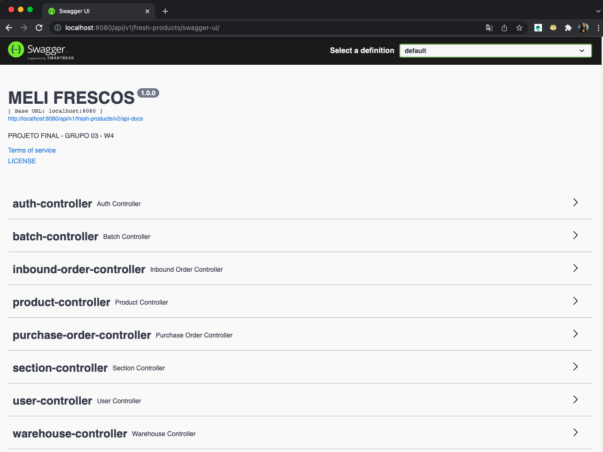

# Projeto Final Bootcamp
Projeto final desenvolvido pelo Grupo 3 da Wave 4 do BOOTCAMP MELI

## Desafio: Requisitos & Apresentação
O Seguinte desafio foi proposto para aplicar os conhecimentos até então alcançados no BootcampIt - Meli.
A descrição do desafio e seus respectivos requisitos se encontram abaixo:
[Kickoff Projeto Integrador](./requisitos/EnunciadoBaseWave4.pdf), [Requisito 1](./requisitos/Requito1.pdf), [Requisito 2](./requisitos/Requito2.pdf), [Requisito 3](./requisitos/Requito3.pdf), [Requisito 4](./requisitos/Requito4.pdf), [Requisito 5](./requisitos/Requito5.pdf), [Requisito 6 - Pedro](./requisitos/Requisito6-deleteInboundOrderByOrderNumber.pdf)

## Ferramentas/tecnologias utilizadas
| Boas praticas | Ferramentas|
|--|--|
|Github Projects, Clean Code, Scrum |Java 11, Maven, SpringMvc, SpringWeb, SpringSecurity, Lombok, JWT, H2|

## Endpoints
Arquivo de rotas do Insomnia: [Insomnia_2022-02-10.json](./insomnia)   
URL Base: `localhost:8080/api/v1/fresh-products`
| Tipo | URI | Função | Payload
|--|--|--|--| 
|POST|/user/|Cadastra um usuário| `{"cpf":"86545843001", "name": "pedro", "username": "pedro",  "email":"pedro@gmail.com", "password":"pedro123", "roles": ["A","S"]}` 
|GET|/user|Retorna lista de usuários|`--` 
|POST|/auth|Autentica o usuário na api| `{username": "useragent",  "password":"12345"}`
|POST|/warehouse|Cria um armazém|`{"code": "SP9", "users": []}`
|GET|/warehouse|Retorna uma lista de armazéns|`--`
|POST|/section|Cria uma section|`{"sectionCode": "frozen", "sectionType": "FROZEN", "maxCapacity": 3, "warehouseCode": "SP1"}`
|GET|/section|Retorna uma lista de seções| `--`
|POST|/product|Cadastra um produto|`{"name":"batata congelada", "productType": "frozen", "price": 3}`
|GET|/product|Retorna uma lista de produtos|`--`
|GET|/product/list?productId=<1,2,3...>&orderBy=<L,C,F>|Retorna uma lista de produtos baseado nos parâmetros|`--`
|POST|/inboundorder|Cadastra um pedido de entrada pro estoque|`{"inboundOrder":{ "orderNumber": 88502, "orderDate": "2001-01-09", "section":{"sectionCode":"frozen","warehouseCode":"SP9"},"batchStock":[{"batchNumber": 23, "productId": 2, "currentTemperature": 11.3, "minimalTemperature": 15.0, "initialQuantity": 100, "currentQuantity": 887, "manufacturingDate": "2022-01-15", "manufacturingTime": "2022-01-15 13:10", "dueDate": "2022-05-25"}]}}`
|UPDATE|/inboundorder|Atualiza um pedido de entrada de estoque|`{"inboundOrder":{ "orderNumber": 88502, "orderDate": "2001-01-09", "section":{"sectionCode":"frozen","warehouseCode":"SP9"},"batchStock":[{"batchNumber": 23, "productId": 2, "currentTemperature": 55.3, "minimalTemperature": 15.0, "initialQuantity": 100, "currentQuantity": 887, "manufacturingDate": "2022-01-15", "manufacturingTime": "2022-01-15 13:10", "dueDate": "2022-05-25"}]}}`
|GET|/inboundorder|Retorna a lista de inboundorder|`--`
|POST|/purchaseorder|Cadastra um pedido de compra|`{"buyerId": "8","orderDate": "2022-02-07", "orderStatus": "C", "products": [{"quantity": 85, "productId": "2"}]}`
|GET|/purchaseorder|Retorna lista dos pedidos de compra| `--`

Observações sobre o projeto/endpoints atendendo os requisitos: 
* Usuário do tipo "B"(comprador) é o único que acessa "/purchaseOrder"
* Usuário do tipo "A"(agente/representante) é o único que acessa "/inboundOrder, /section, /warehouse"
* Para criar uma entrada de estoque (inboundOrder), precisa estar com a section, warehouse e produto(s) já cadastrados.
* Algumas requests de filtragem e ordenação não estão pré-cadastradas no arquivo de insomnia, mas estão funcionais de acordo com os requisitos. Estas dependem de variáveis a seram escolhidas, ou de acordo com cadastros realizados.

Usuários já cadastrados:
- `{"username": "userbuyer","password":"12345"} //Usuário comprador`  
- `{"username": "useragent","password":"12345"}  //Usuário agente--o mesmo que representante`

## Swagger

Após iniciar o projeto a página do Swagger fica disponível [nesta URL](http://localhost:8080/api/v1/fresh-products/swagger-ui/)

### Integrantes
* [Emanuelle Besckow Figueiredo](https://github.com/emanuellebesckow)
* [Pedro Sol Barbosa Montes](https://github.com/pedroSolMeli) 
* [Ana Gabriela Siqueira Franco](https://github.com/AnaGFranco) 
* [Douglas Santos Rodrigues](https://github.com/douglassrodml)
* [Renan Santana Sousa](https://github.com/renanmeli)
* [Willy de Jesus Passos](https://github.com/wjpassos)
